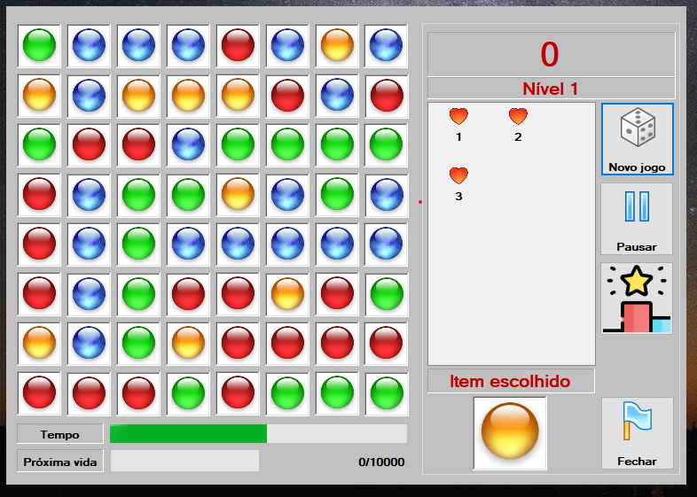

## Bloquinhos

Joguinho feito por [Ygor Lazaro](http://www.github.com/ygorlazaro) na época da Pysi.

A Pysi foi uma agência web fundada por [Ygor Lazaro](http://www.github.com/ygorlazaro) e [Juan Saint' Clair](http://www.github.com/juansaintclair) em 2009. Substituída pela Making Amazing em 2012, foram unificadas na [Gato Ninja](http://www.github.com/gatoninja) em 2015.

## Sobre o Jogo

O jogo consiste em clicar na cor escolhida pelo computador em cada fase, de modo que se preencha todo o tabuleiro com quadrados pretos.

A velocidade do jogo aumenta a cada nível.

## Mais informações

* [Site da Gato Ninja](http://www.gatoninja.com.br)
* [Site de Ygor Lazaro](http://www.ygorlazaro.com)
